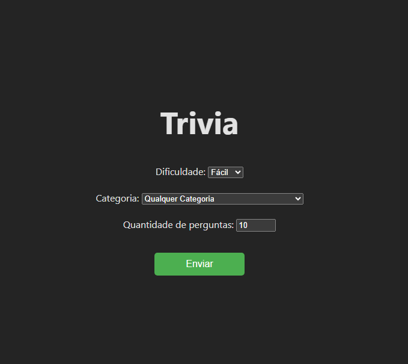
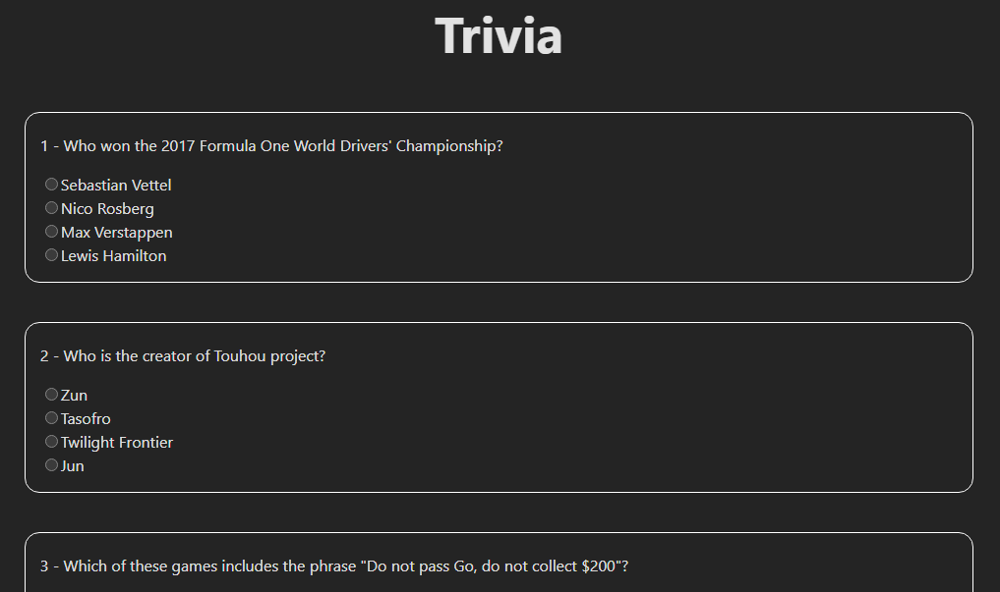
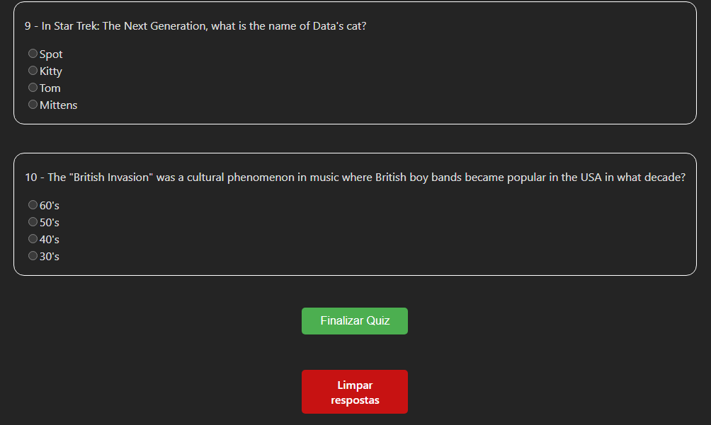
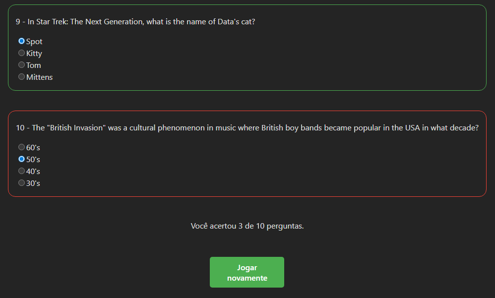

# Projeto Trivia Quiz

Este é um projeto de aplicação web de quiz de conhecimentos gerais, onde os usuários podem testar seus conhecimentos respondendo a perguntas de múltipla escolha.

O projeto foi desenvolvido como um exercício para aprimorar habilidades em **React** e **gerenciamento de estado de formulários**.

---

## 📋 Tabela de Conteúdos
- [Tecnologias Utilizadas](#-Tecnologias-Utilizadas)
- [Funcionalidades](#-funcionalidades)
- [Capturas de Tela](#-Capturas-de-Tela)
- [Como Instalar e Rodar o Projeto](#-Como-Instalar-e-Rodar-o-Projeto)
- [Como o Projeto foi Construído](#-Como-o-Projeto-foi-Construído)
- [Autor](#-autor)

---

## 🚀 Tecnologias Utilizadas

* **React:** Biblioteca JavaScript para construir interfaces de usuário.
* **React Hook Form:** Biblioteca para gerenciar o estado e a validação do formulário de forma performática.
* **Styled Components:** Biblioteca para escrever CSS dentro de componentes JavaScript, facilitando a criação de estilos dinâmicos e modularizados.
* **API Open Trivia DB:** A API pública utilizada para obter as perguntas e respostas do quiz.
* **JavaScript (ES6+)**
* **HTML5**
* **CSS3**

---

## ✨ Funcionalidades

* **Seleção de Dificuldade e Categoria:** O usuário pode escolher a dificuldade (fácil, médio, difícil), a categoria, e a quantidade de perguntas. <br/>
PS: As perguntas estão apenas em inglês por virem da API.
* **Quiz Dinâmico:** As perguntas e respostas são carregadas de uma API externa.
* **Respostas Embaralhadas:** As opções de resposta de cada pergunta são apresentadas em uma ordem aleatória a cada rodada.
* **Validação de Respostas:** O quiz verifica as respostas do usuário e calcula a pontuação final.
* **Interface Interativa:** Feedback visual claro sobre acertos e erros após a finalização do quiz.

---

## 📸 Capturas de Tela






---

## ⚙️ Como Instalar e Rodar o Projeto

Para rodar este projeto localmente, siga os passos abaixo:

1.  **Clone o repositório:**
    ```bash
    git clone https://github.com/EvandroBaraka/project-trivia.git
    cd projeto-trivia
    ```

2.  **Instale as dependências:**
    ```bash
    npm install
    ```

3.  **Inicie a aplicação:**
    ```bash
    npm run dev
    ```
    O aplicativo será aberto automaticamente no seu navegador padrão em `http://localhost:3000/project-trivia/`.

---

## 🛠️ Como o Projeto foi Construído

O projeto segue a abordagem de **componentização** do React. O componente principal `Form` gerencia o estado da aplicação e delega a renderização para componentes filhos:

* **`QuizInitialForm`**: Responsável por renderizar a interface de seleção de dificuldade e categoria.
* **`QuizQuestions`**: Exibe todas as perguntas do quiz, usando o componente `Question` para cada uma.
* **`QuizResults`**: Mostra a pontuação final do usuário.

A comunicação entre os componentes é feita através de **props**, e o gerenciamento do estado global é mantido no componente pai (`Form`) para garantir que os dados fluam em uma única direção.

## 👤 Autor

👨‍💻 **Evandro Passaia**  
- GitHub: [@EvandroBaraka](https://github.com/EvandroBaraka)  
- LinkedIn: [Evandro Passaia](https://www.linkedin.com/in/evandro-passaia-62b9a5269/)  
- Facebook: [Evandro Passaia](https://www.facebook.com/evandro.passaiaze/)